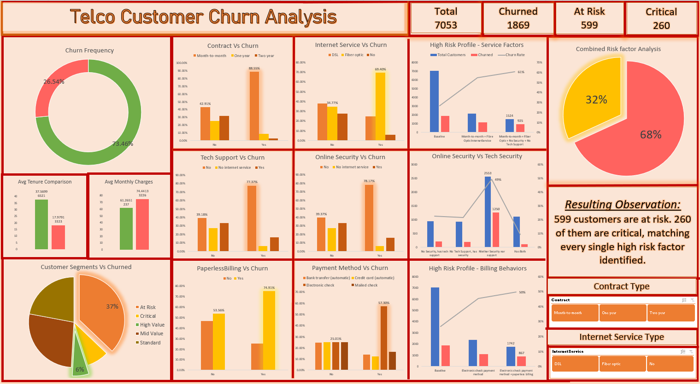

# Telco Customer Churn Analysis — Excel

## Project Overview
An end-to-end data analysis project examining customer churn 
patterns for a telecommunications company. Built entirely in 
Microsoft Excel using Power Query, Pivot Tables, and an 
interactive dashboard.

The central question: **What kind of customer is most likely 
to churn, and why?**

---

## Dataset
- **Source:** IBM Telco Customer Churn Dataset (Kaggle)
- **Size:** 7,043 customers, 21 columns
- **Target Variable:** Churn (Yes/No)

---

## Tools & Features Used
- **Power Query** — data cleaning pipeline with documented 
  transformation steps
- **Excel Tables** — structured referencing for all formulas
- **Pivot Tables** — multi-dimensional churn analysis
- **COUNTIFS / AVERAGEIF / PERCENTILE** — dynamic 
  analytical formulas
- **XLOOKUP** — customer profile lookup
- **Conditional Formatting** — risk highlighting
- **Interactive Dashboard** — slicers, KPIs, pivot charts

---

## Methodology

### Data Cleaning (Power Query)
- Removed duplicates on CustomerID
- Replaced null TotalCharges with 0 for new customers
- Converted SeniorCitizen from 0/1 integers to Yes/No
- Standardized text casing and trimmed whitespace
- All steps documented in Applied Steps pane

### Customer Segmentation
A 5-tier segmentation was developed using MonthlyCharges 
and TenureInMonths — chosen because value cannot be 
accurately measured by a single metric.

Thresholds were set at the 25th and 75th percentiles of 
each column's distribution (data-driven, not arbitrary):

| Segment | Condition |
|---|---|
| High Value | Charges ≥ $89.85 AND Tenure ≥ 55 months |
| Mid Value | Charges ≥ $89.85 OR Tenure ≥ 55 months |
| Standard | Between thresholds in both |
| At Risk | Charges ≤ $35.50 OR Tenure ≤ 9 months |
| Critical | Charges ≤ $35.50 AND Tenure ≤ 9 months |

TotalCharges was excluded as it is mathematically derived 
from the two source columns and contains data quality 
limitations for new customers.

---

## Key Findings

### Overall Churn
- 26.54% of customers churned (1,869 of 7,043)
- Retained customers averaged 37.57 months tenure vs 
  17.97 months for churners
- Churned customers paid higher average monthly charges 
  ($74.44 vs $61.23) — suggesting price sensitivity 
  combined with lack of contract commitment drive churn

### Individual Churn Drivers
| Factor | Key Finding |
|---|---|
| Contract Type | 88.55% of churners were on month-to-month |
| Online Security | 78.17% of churners had no online security |
| Tech Support | 77.37% of churners had no tech support |
| Paperless Billing | 74.91% of churners used paperless billing |
| Internet Service | 69.40% of churners had fiber optic |
| Payment Method | 57.30% of churners used electronic check |

### Combined High Risk Profile — Service Factors
Customers on month-to-month contracts with fiber optic 
internet, no online security and no tech support churn 
at **61%** — more than double the 27% baseline.

| Profile | Churn Rate |
|---|---|
| Baseline | 27% |
| + Month-to-month + Fiber Optic | 55% |
| + No Security + No Tech Support | 61% |

### Combined High Risk Profile — Billing Factors
| Profile | Churn Rate |
|---|---|
| Baseline | 27% |
| + Electronic Check | 45% |
| + Paperless Billing | 50% |

### Security & Tech Support Hypothesis
Customers lacking **both** services churn at 49% vs 22% 
for those missing only one — confirming these factors 
compound each other rather than acting independently.

### Ultimate High Risk Profile (All 6 Factors)
816 customers match all six risk factors. 556 have already 
churned (68%). **260 remain active — the highest priority 
retention targets in the dataset.**

---

## Recommendations
1. **Prioritize contract conversion** — incentivize 
   month-to-month customers to upgrade to one or two year 
   contracts through targeted discounts
2. **Bundle security and support services** — customers 
   with both services churn at only 9%; proactive upselling 
   could significantly reduce churn
3. **Target the 260 critical customers immediately** — 
   these match every high risk factor and represent the 
   highest churn probability in the dataset
4. **Investigate fiber optic service quality** — high 
   charges combined with poor service value appears to 
   drive dissatisfaction despite premium pricing

---

## Project Structure
│
├──Telco_Churn_Analysis.xlsx    # Main workbook
├── dashboard_preview.png         # Dashboard screenshot
└── README.md                     # This file

---

## Skills Demonstrated
`Excel` `Power Query` `Pivot Tables` `Data Cleaning` 
`Exploratory Data Analysis` `Customer Segmentation` 
`Data Visualization` `Dashboard Design` `Business Analysis`
